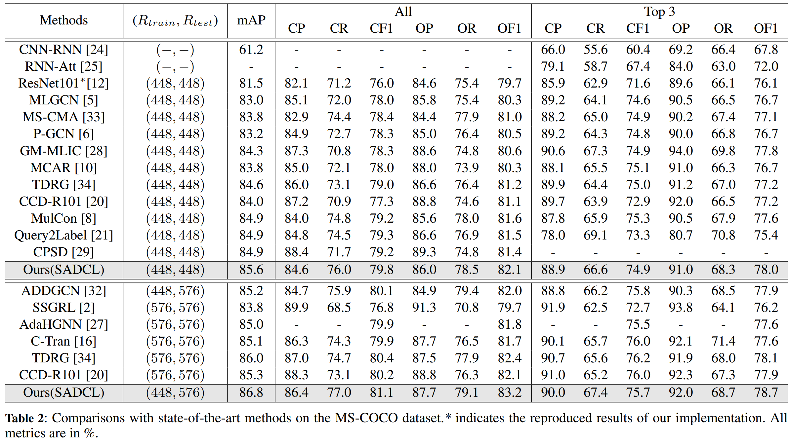
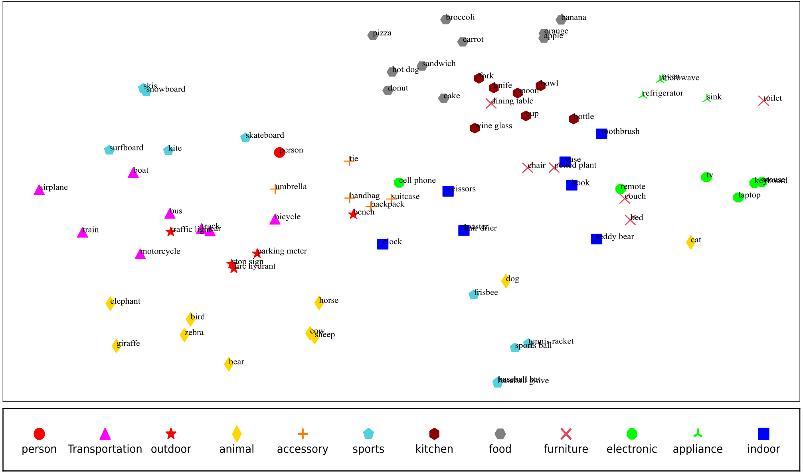
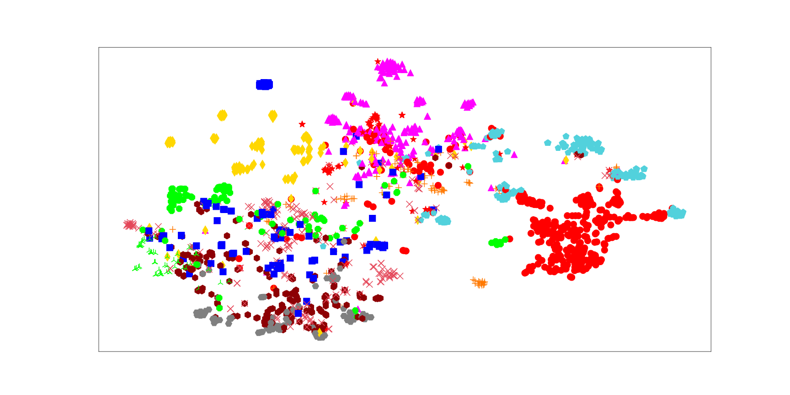
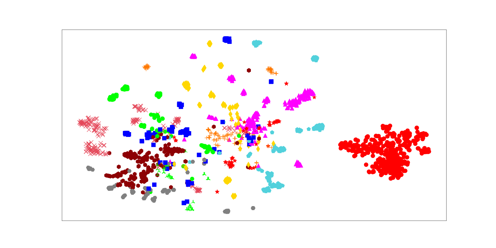
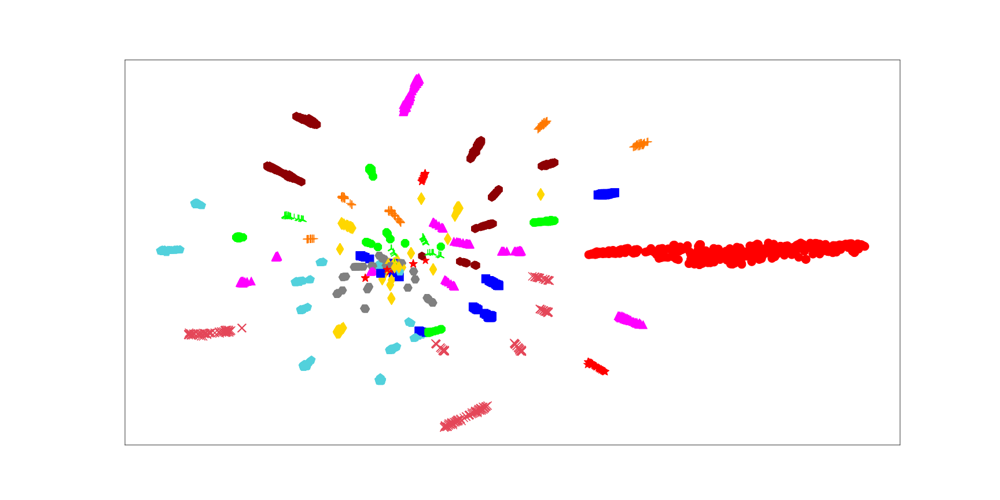

# SADCL
Official PyTorch implementation of the paper "[Semantic-Aware Dual Contrastive Learning for Multi-label Image Classification](https://arxiv.org/format/2307.09715)"


Our paper was accepted by ECAI2023(European Conference on Artificial Intelligence).


## Results on MS-COCO2014



## Visualization
### prototypes


### category-related attention maps


### 2000 label-level visual representations

#### without dual contrastive learning

#### with dual contrastive learning


#### with dual contrastive learning (Projector head)


# BibTex
```
@article{ma2023semantic,
  title={Semantic-Aware Dual Contrastive Learning for Multi-label Image Classification},
  author={Ma, Leilei and Sun, Dengdi and Wang, Lei and Zhao, Haifang and Luo, Bin},
  journal={arXiv preprint arXiv:2307.09715},
  year={2023}
}

```
# Contact US
In case of any queries, please feel free to contact us for assistance.
E-mail: xiaoleilei1990@gmail.com

# Acknowledgement
We thank the authors of Query2label, detr, for their great works and codes. Thanks to @SlongLiu for providing a useful script for training.